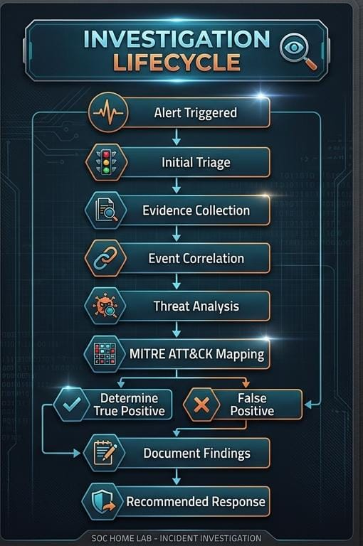

# Incident Reports

## Overview

This directory contains incident investigation reports generated from security alerts detected in the Splunk SOC Home Lab.

Each report follows a structured SOC investigation process, including alert analysis, evidence collection, investigation, MITRE ATT&CK mapping, and final disposition.

---
##  presentation



## Investigation Lifecycle

```text
Alert Triggered
      ↓
Initial Triage
      ↓
Evidence Collection
      ↓
Event Correlation
      ↓
Threat Analysis
      ↓
MITRE ATT&CK Mapping
      ↓
Determine True Positive / False Positive
      ↓
Document Findings
      ↓
Recommended Response


