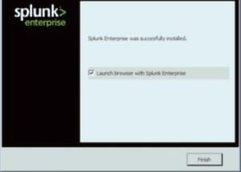

# Splunk Enterprise Installation

## Objective

The objective of this step is to install Splunk Enterprise on the monitoring server to collect, index, search, and analyze security logs generated from Windows endpoints.

---

# Lab Environment

| Component | Details |
|-----------|---------|
| Operating System | Ubuntu Server |
| SIEM | Splunk Enterprise |
| Endpoint | Windows 10 VM |
| Log Source | Sysmon |
| Hypervisor | VirtualBox |

---

# System Requirements

- Ubuntu Server
- Minimum 4 GB RAM
- 2 CPU Cores
- 20 GB Free Disk Space
- Internet Connection

---

# Download Splunk Enterprise

Download Splunk Enterprise from the official Splunk website.

---

# Installation Steps

### 1. Update Ubuntu

```bash
sudo apt update && sudo apt upgrade -y
```

### 2. Install Splunk Package

```bash
sudo dpkg -i splunk-*.deb
```

### 3. Start Splunk

```bash
sudo /opt/splunk/bin/splunk start
```

Accept the license agreement and create an administrator username and password.

---

### 4. Enable Splunk at Boot

```bash
sudo /opt/splunk/bin/splunk enable boot-start
```

---

# Verify Installation

Open your browser.

```
http://<Splunk-IP>:8000
```

Login using the administrator credentials.

---

# Expected Result

- Splunk Web Interface is accessible.
- Dashboard loads successfully.
- Search & Reporting application is available.

---

# Screenshot


Example:

```


```

---

# Troubleshooting

### Splunk service status

```bash
sudo /opt/splunk/bin/splunk status
```

### Restart Splunk

```bash
sudo /opt/splunk/bin/splunk restart
```

### Check Logs

```bash
cd /opt/splunk/var/log/splunk
```

---

# Outcome

Splunk Enterprise has been successfully installed and is ready to receive logs from Windows endpoints through the Splunk Universal Forwarder.
