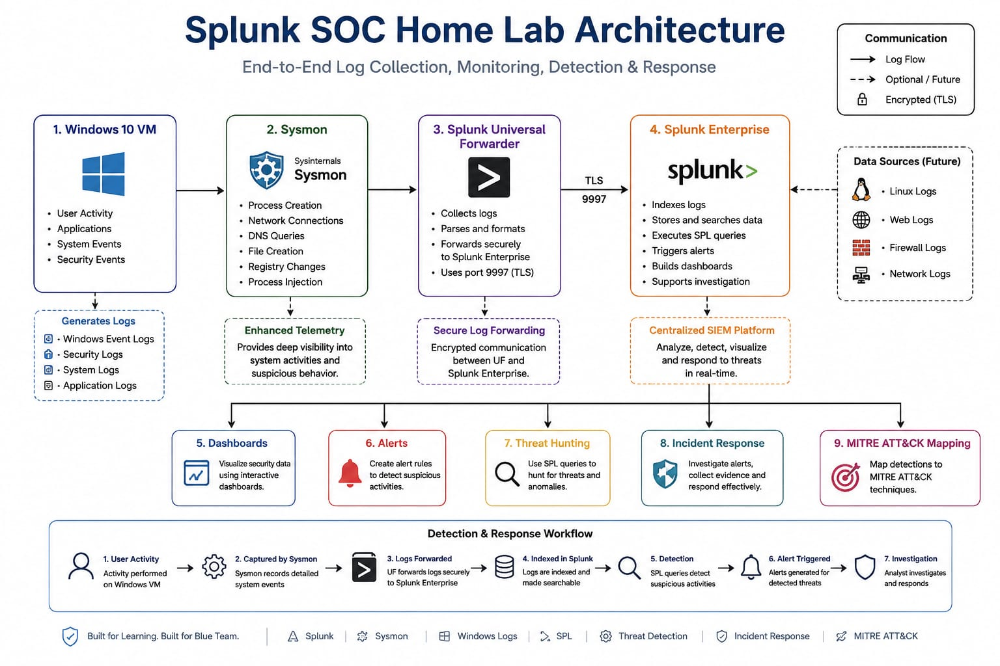

# 🛡️ Splunk SOC Home Lab


A hands-on **Security Operations Center (SOC) Home Lab** built to practice security monitoring, threat detection, threat hunting, alert investigation, and incident response using **Splunk Enterprise, Sysmon, Windows Event Logs, and SPL**.

---

## 🎯 Project Objective

The goal of this project is to build a practical SOC environment where endpoint telemetry can be collected, analyzed, detected, visualized, and investigated using Splunk.

The lab focuses on developing practical SOC Analyst skills rather than only theoretical knowledge.

---

## 🏗️ Lab Architecture



### Data Flow

```text
Windows Endpoint
       ↓
     Sysmon
       ↓
Windows Event Logs
       ↓
Splunk Universal Forwarder
       ↓
Splunk Enterprise
       ↓
SPL Detection
       ↓
Dashboards / Alerts
       ↓
Threat Hunting & Incident Investigation
```

---

## 🧰 Technologies Used

| Technology | Purpose |
|---|---|
| Splunk Enterprise | SIEM & log analysis |
| Splunk Universal Forwarder | Log collection & forwarding |
| Sysmon | Endpoint telemetry |
| Windows | Security event source |
| SPL | Detection & investigation |
| VirtualBox | Virtual lab environment |
| MITRE ATT&CK | Adversary behavior mapping |

---

## 🔍 Security Monitoring

The lab monitors multiple types of endpoint activity:

- Authentication Events
- PowerShell Activity
- Process Creation
- DNS Queries
- Network Connections
- Registry Modifications

---

## 🔎 SPL Detection Queries

The repository contains SPL queries for:

- Authentication Monitoring
- PowerShell Detection
- Process Creation
- DNS Monitoring
- Network Monitoring
- Registry Monitoring

See:

📂 [`SPL-Queries`](SPL-Queries/)

---

## 📊 Splunk Dashboards

The lab includes dashboards designed for SOC monitoring.

### Current Dashboards

- Security Overview
- Authentication Monitoring
- PowerShell Monitoring

Dashboards provide visibility into:

- Total Security Events
- Authentication Activity
- PowerShell Execution
- Event Trends
- Top Users
- Top Hosts
- Event IDs

See:

📂 [`Dashboards`](Dashboards/)

---

## 🚨 Security Alerts

Automated detections are documented for:

- Multiple Failed Login Attempts
- PowerShell Activity
- Suspicious Process Creation
- DNS Activity

See:

📂 [`Alerts`](Alerts/)

---

## 🕵️ Incident Investigation

The project documents the investigation workflow from alert generation to final classification.

### Investigation Process

```text
Alert
  ↓
Initial Triage
  ↓
Evidence Collection
  ↓
Event Correlation
  ↓
Threat Analysis
  ↓
MITRE ATT&CK Mapping
  ↓
True Positive / False Positive
  ↓
Response Recommendation
```

See:

📂 [`Incident-Reports`](Incident-Reports/)

---

## 🎯 MITRE ATT&CK Coverage

Current detection coverage includes:

| Technique | ID | Detection |
|---|---|---|
| Brute Force | T1110 | Failed Authentication |
| Valid Accounts | T1078 | Successful Authentication |
| PowerShell | T1059.001 | PowerShell Activity |
| Command & Scripting Interpreter | T1059 | Process Activity |
| DNS | T1071.004 | DNS Queries |
| Modify Registry | T1112 | Registry Activity |

See:

📂 [`MITRE-Mapping`](MITRE-Mapping/)

---

## 📸 Screenshots

Screenshots demonstrating the lab implementation, dashboards, alerts, and investigations are available here:

📂 [`Screenshots`](Screenshots/)

---

## 📚 Project Documentation

| Section | Description |
|---|---|
| [`Architecture`](Architecture/) | SOC lab architecture |
| [`Installation`](Installation/) | Splunk, Forwarder & Sysmon setup |
| [`SPL-Queries`](SPL-Queries/) | Detection & investigation queries |
| [`Dashboards`](Dashboards/) | Splunk security dashboards |
| [`Alerts`](Alerts/) | Detection alerts |
| [`Incident-Reports`](Incident-Reports/) | SOC investigations |
| [`MITRE-Mapping`](MITRE-Mapping/) | MITRE ATT&CK mapping |
| [`Screenshots`](Screenshots/) | Lab evidence |

---

## 🚀 Skills Demonstrated

This project demonstrates practical experience with:

- SIEM Operations
- Splunk
- SPL
- Windows Event Logs
- Sysmon
- Log Analysis
- Threat Detection
- Threat Hunting
- Security Monitoring
- Alert Triage
- Incident Investigation
- MITRE ATT&CK
- Basic Incident Response

---

## 🔄 Project Status

**Status:** 🚧 In Progress

Planned improvements:

- [ ] Additional SPL detections
- [ ] Advanced correlation searches
- [ ] More Splunk dashboards
- [ ] Risk-based alerting
- [ ] Additional MITRE ATT&CK coverage
- [ ] More incident investigation scenarios
- [ ] Detection tuning and false-positive reduction

---

## ⚠️ Disclaimer

This project is created for **educational and defensive cybersecurity purposes** in a controlled home-lab environment.

All testing and simulated security activity is performed on systems owned or authorized by the lab operator.

---

## 👤 Author

**Rishabh**

Aspiring SOC Analyst | Splunk | SIEM | Sysmon | Threat Hunting | Blue Team

---

⭐ If you find this project useful, feel free to explore the documentation and detection use cases.
