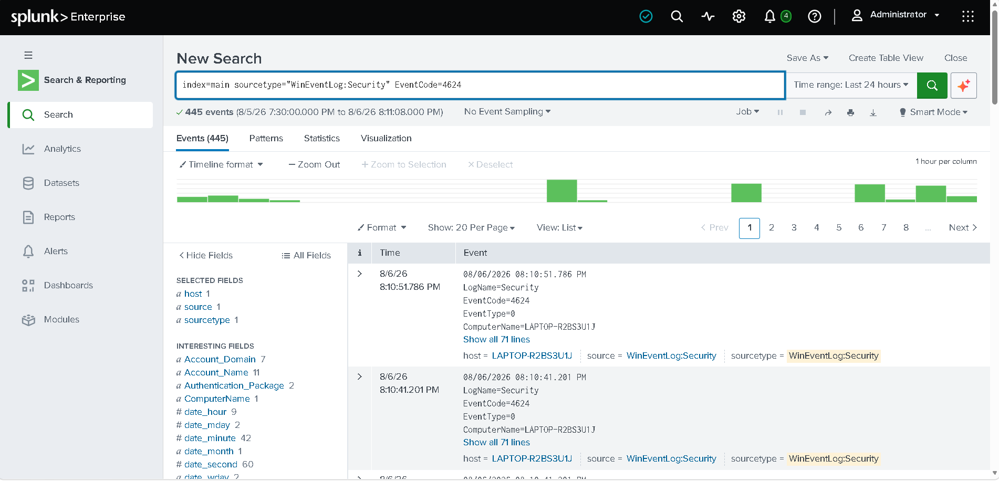
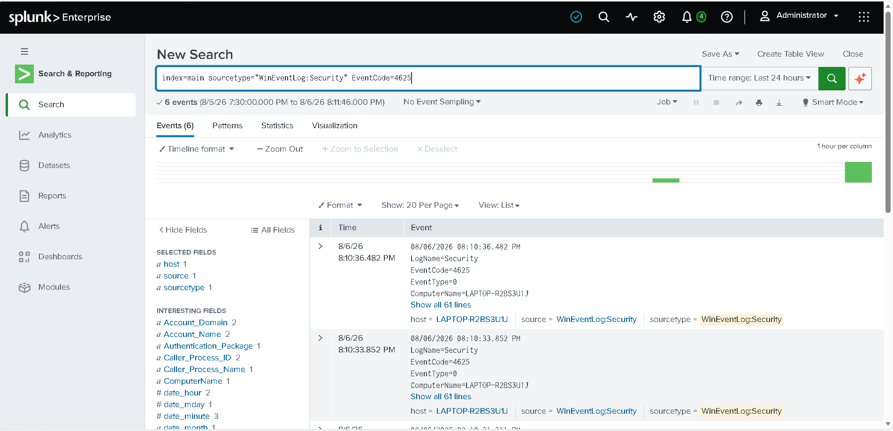

# Authentication Monitoring

## Objective

Detect successful and failed login attempts to identify unauthorized access and brute-force attacks.

---

## Successful Login

```spl
index=windows EventCode=4624
| table _time Account_Name Logon_Type host
```

### Description

Displays all successful logins recorded by Windows Security Logs.

MITRE ATT&CK

- T1078 - Valid Accounts

---

## Failed Login

```spl
index=windows EventCode=4625
| stats count by Account_Name host Failure_Reason
```

### Description

Detects failed login attempts that may indicate password guessing or brute-force activity.

MITRE ATT&CK

- T1110 - Brute Force

---

## Screenshot





---

## Outcome

Authentication events can be monitored to detect suspicious login activity.
