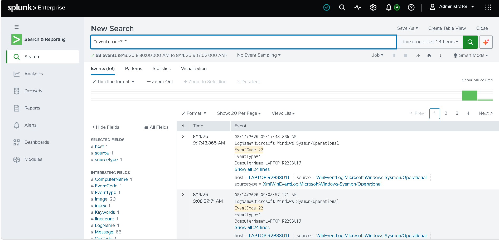
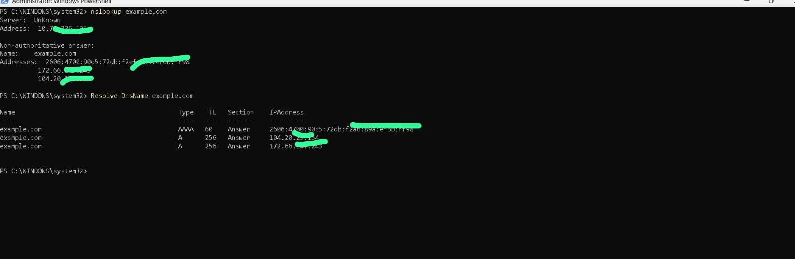

# DNS Monitoring

## Objective

Monitor DNS requests generated by endpoints.

---

## SPL Query

```spl
index=main EventCode=22
```

---

## Description

Shows DNS queries captured by Sysmon.

MITRE ATT&CK

- T1071.004

---

## Screenshot





🔒 IP addresses have been blurred for security and privacy reasons.

---

## Outcome

DNS activity helps detect suspicious domain lookups.
