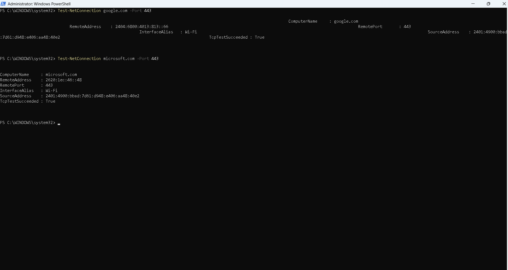
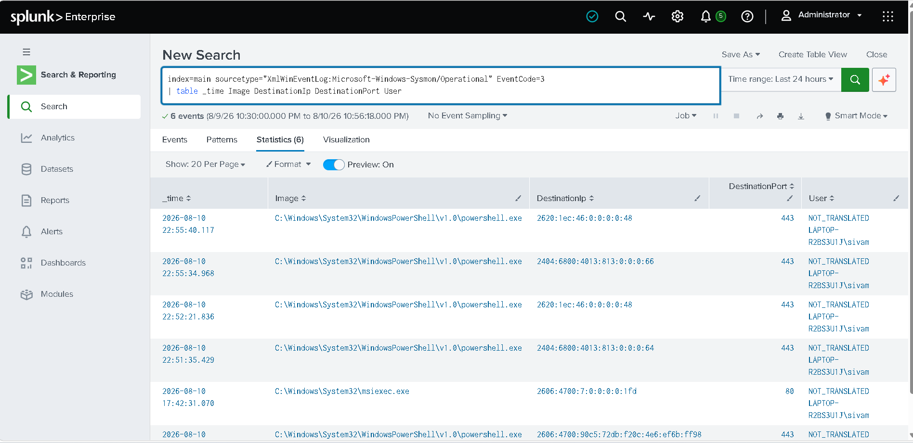

# Network Connection Monitoring

## Objective

Monitor outbound network connections from Windows endpoints using Sysmon Event ID 3 in Splunk.

---

## Data Source

- **Log Source:** Microsoft Sysmon
- **Event ID:** 3
- **Event:** Network Connection
- **Splunk Index:** `main`
- **Sourcetype:** `XmlWinEventLog:Microsoft-Windows-Sysmon/Operational`

---

## SPL Query

```spl
index=main sourcetype="XmlWinEventLog:Microsoft-Windows-Sysmon/Operational" EventCode=3
| table _time Image DestinationIp DestinationPort User
| sort - _time


## Screenshot



