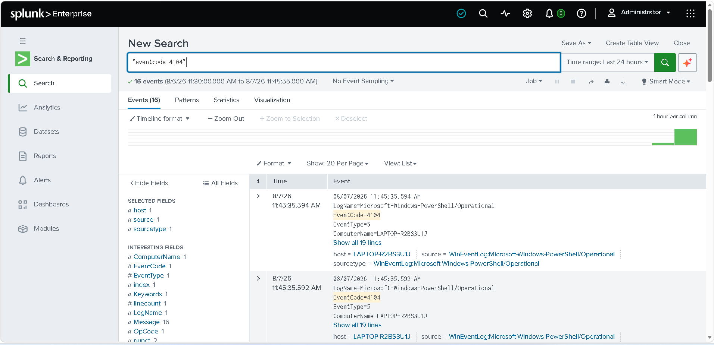
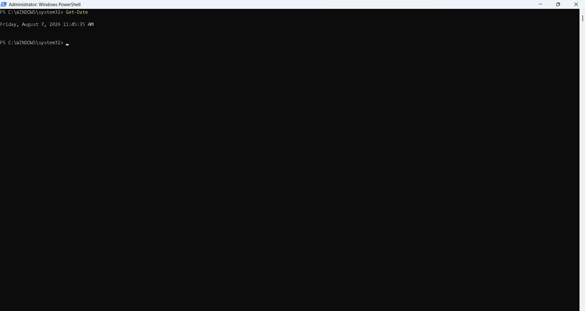

# PowerShell Monitoring

## Objective

Detect PowerShell execution for threat hunting.

---

## SPL Query

```spl
index=windows EventCode=4104
| table _time ComputerName User ScriptBlockText
```

---

## Description

Shows PowerShell script block logging events.

MITRE ATT&CK

- T1059.001 - PowerShell

---

## Suspicious PowerShell

```spl
index=windows EventCode=4104
| search ScriptBlockText="*Invoke-*"
```

---

## Screenshot




---

## Outcome

PowerShell activity is visible inside Splunk.
