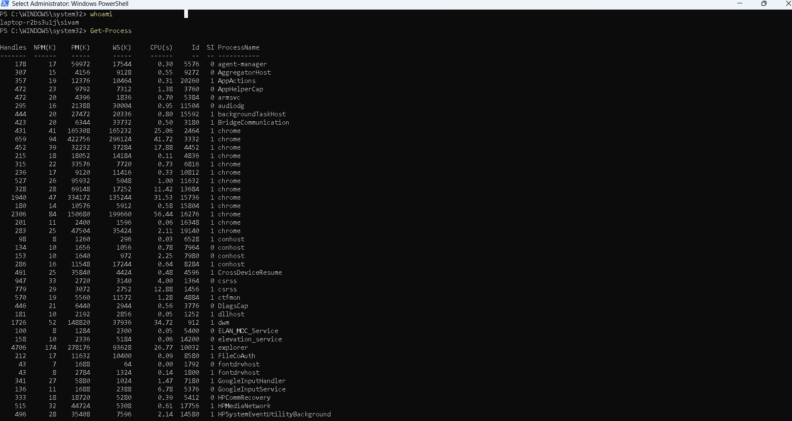
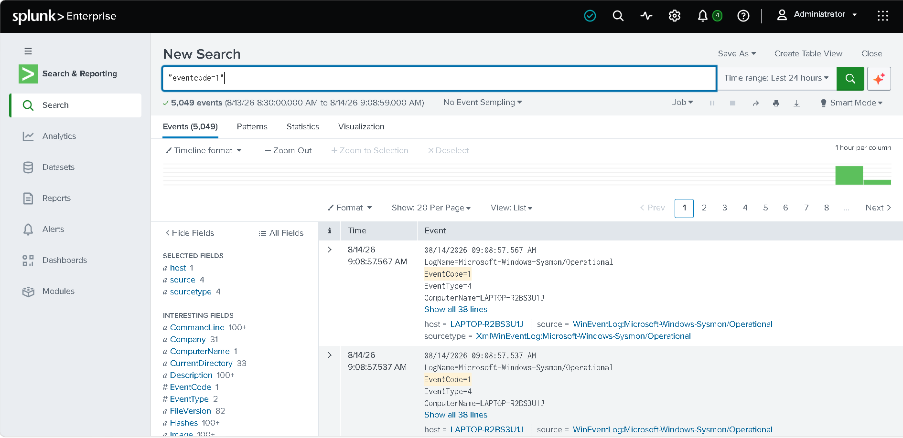

# Process Creation Monitoring

## Objective

Monitor newly created processes using Sysmon.

---

## SPL Query

```spl
index=windows EventCode=1
| table _time Image ParentImage CommandLine User
```

---

## Description

Displays every process created on the endpoint.

MITRE ATT&CK

- T1059
- T1204

---

## Screenshot





---

## Outcome

Process execution can be investigated for suspicious behavior.
