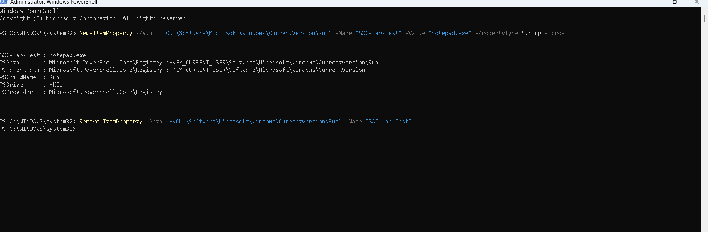
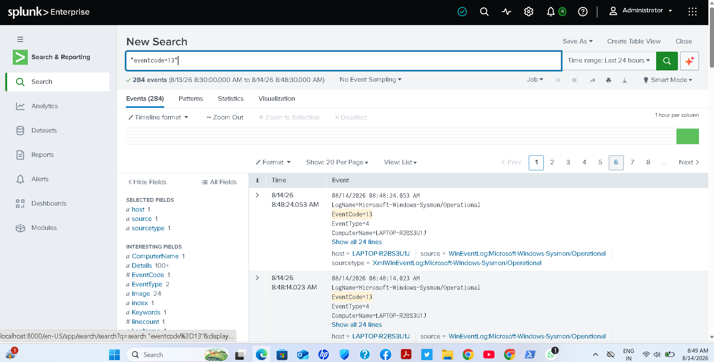

Registry Monitoring

Objective

Detect registry modifications using Sysmon.

---

SPL Query

index=windows EventCode=13  
| table _time TargetObject Image User

---

Description

Shows registry value modifications.

MITRE ATT&CK

T1112

---

Screenshot

---

Outcome

Registry changes can be monitored for persistence techniques.
